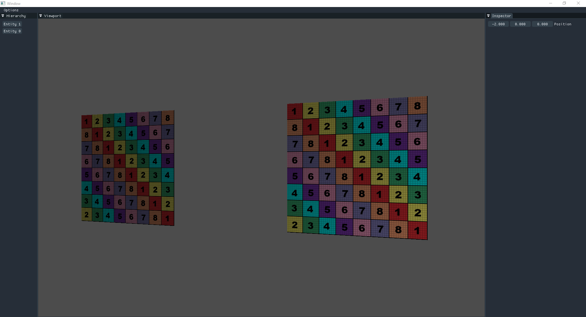

# Dusk

**Dusk is a WIP 3D Game Engine**. It is a personal project where I am learning more about how a game engine and all of its systems function under the hood. It is aiming to be a simple tool that can create games for multiple platforms.

## Current Features

Dusk is very early in development and so its features are barebones.

- Uses a build system for the project and all its dependencies
- Logging system
- Simple 3D Rendering
- Ability to import 3D models (.fbx or .obj)
- Phong Lighting
- Material System
- Resource management with UUIDs
- Resource de/serialization (Scenes, Materials) 
- ECS using entt
- Editor tool using imgui

## Goals

It is always good to have goals that push you forward and give you a glimpse of what the future might hold.

- Better editor tool
- Support for multiple graphics APIs
- Concept of a Runtime
- Ability to export games
- Mono Scripting
- Physics
- Audio
- Profiling
- Multithreaded
- PBR workflow
- Concept of Projects

And many many more.

## Building Dusk

*Dusk used to compile on both MSVC for Windows and GCC for Linux. However, at he moment, the GCC setup is broken and the project does not compile sucessfully. This will hopefully be fixed in the future.*

To build Dusk from source, first clone the repository and all of its submodules.

`git clone --recurse-submodules https://github.com/qolisipo/Dusk` 

Dusk uses [premake](https://premake.github.io/) as its build system. 

To generate the project files, run premake from the project root directory and choose the targeted environment.

- VS2019 `premake5.exe vs2019`
- GCC &nbsp;&nbsp;&nbsp;&nbsp; `./premake5 gmake2`

After these steps the project should compile and run.

## Dependencies

Building a game engine is a massive task, and although I am trying to learn as much as possible about every nook and crany, sometimes shortcuts must be taken so I can maximize my time, effort and focus. Therefore I am resorting to popular libraries for certain functionality.
Some of these libraries will be swapped out in the future for a custom solution, once I feel like its time/the engine is a bit more mature.

[Dependencies List](https://github.com/qolisipo/Dusk/blob/main/DEPENDENCIES.md)
