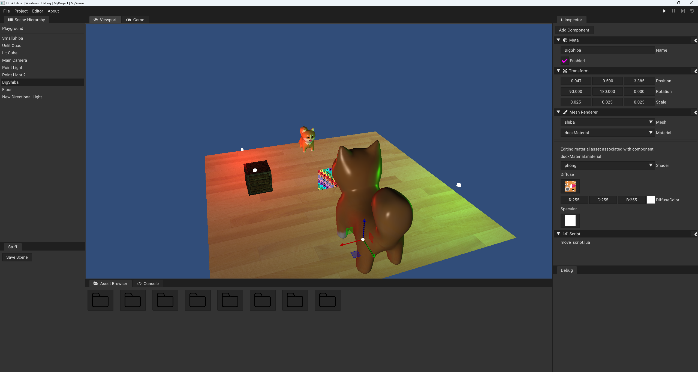

# Dusk

**Dusk is a WIP 3D Game Engine**. It is a personal project where I am learning more about how a game engine and all of its systems function under the hood. It is aiming to be a simple tool that can create games for multiple platforms.

# Table of Contents

  * [Features](#features)
  * [Goals](#goals)
  * [Getting Dusk](#getting-dusk)
    * [Building Dusk](#building-dusk)
    * [Binaries](#binaries)
  * [Dependencies](#dependencies)
  * [Resources](#resources)
  * [Screenshots](#screenshots)
  * [The Story](#the-story)
  
# Features

Dusk is still early in development and so its features are barebones.

- Using a build system for all project modules and dependencies - with multiple target platforms and release configurations
- Cross Platform - supports Windows and Linux
- Logging system 
- Simple 3D Rendering with rudimentary lighting
- 3D model importing (.fbx and .obj)
- Image (.png and .jpeg) importing to custom engine-ready format
- Asset management with UUIDs
- Material System
- Entity Component System, similar in use to Unity's
- Embedded the lua language for easy scripting
- Editor tool with level editor, scene hierarchy, entity inspector & asset browser
- Concept of a project
- Notion of a runtime (albeit very simple and not practical yet)
  
# Goals

It is always good to have goals that push you forward and give you a glimpse of what the future might hold.

Dusk's short term goal is to reach the MVP stage of a game engine. Hopefully, come January/February, Dusk's first release will happen.
The immediate goals for this release to happen are:

- Embedding all editor assets into the binary itself to allow for easy distribution of the editor
- Importing of .gltf models (support for other formats will be dropped)
- Importing of external assets to custom engine-ready format
- Packaging of games assets into binary blob to allow for easy and safe distribution of a game
- Virtual file system to navigate the generated package
- Generic improvements
  - Improve overall quality of the codebase
  - Better editor wtih more functionality
  - Better scripting with a larger API
  - Better rendering

Beyond these goals lie a lot more, but for now, I am keeping focused on reaching this MVP stage.

# Getting Dusk

## Building Dusk

*I only test Dusk on Linux every so often so it is possible that the project does not compile with gcc from time to time.*

To build Dusk from source, first clone the repository and all of its submodules.

`git clone --recurse-submodules https://github.com/qolisipo/Dusk` 

Dusk uses [premake](https://premake.github.io/) as its build system. 

To generate the project files, run premake from the project root directory and choose the target environment.

- VS2022 `premake5.exe vs2022`
- GCC &nbsp;&nbsp;&nbsp;&nbsp; `./premake5 gmake2`

After these steps the project should compile and run.

Dusk is split into 3 projects.

The engine, the editor, and the runtime.

The engine is built as a static library and links into the editor and runtime executables. 
It is dependent and includes functionality from a variety of [libraries](https://github.com/qolisipo/Dusk/blob/main/.github/DEPENDENCIES.md), which are all also linked into the editor and runtime (if needed).

The editor has 2 target configurations, Debug and Release. The runtime and engine have 3. Debug, Release and ReleaseNoImGui. The latter will not link ImGui into the runtime and will remove ImGui's code from the engine.

In the future there might be more template runtimes with less functionality in them for smaller distributables. 

## Binaries

For the time being, Dusk is only distributed as source code. Once the MVP stage is reached, a build for both Windows and Linux will be available on the [Releases tab](https://github.com/qolisipo/Dusk/releases). 

# Dependencies

Building a game engine is a massive task, and although I am trying to learn as much as possible about every nook and crany, sometimes shortcuts must be taken so I can maximize my time, effort and focus. Therefore I am resorting to popular libraries for certain functionality.
Some of these libraries will be swapped out in the future for a custom solution, once I feel like it is time/the engine is more mature.

[Dependencies List](https://github.com/qolisipo/Dusk/blob/main/.github/DEPENDENCIES.md)

On another note, by researching and using a wide array of external libraries, I have gained a lot of experience in diving into different codebases and learning how to use them.

On top of that, I also wrote custom premake5 scripts for them which required me to really have an understanding of the lib and how it was built and is supposed to be used. It also gave me a better understanding of build systems work.

# Resources

Building this project has been quite the journey. I could never have made it this far without all the resources out there pointing me in the right direction and providing motivation along the way. 

In order to remain as wary and absorb as much information as possible, I try to look at lots of different sources, always cross checking information and making sure to follow it up with the comments on the video/article and other programmers. I find this last aspect very important, as it can  lead me to new directions and prevent common gotchas. 

Interacting, discussing and learning from other devs online has been a key part of my learning experience, and has helped me push my knowledge and this project even further.

Among all the resources I used, there is one that stands out.  
[The Cherno](https://www.youtube.com/channel/UCQ-W1KE9EYfdxhL6S4twUNw) is a youtuber who has been developing his own engine called Hazel, recording tutorials and dev-logs of the process. He also has a lot of other videos on topics such as C++, game engines, rendering, and more.  
Dusk's early development was very inspired by Hazel as I was still riding this bicycle with training wheels, but has since grown a lot, both in terms of implementation and goals.

[Resources List](https://github.com/qolisipo/Dusk/blob/main/.github/RESOURCES.md)

# Screenshots

<i>Dusk running on Linux</i>

# The Story

If you are interested in reading about the journey that led me to this project, refer [here](https://github.com/qolisipo/Dusk/blob/main/.github/STORY.md).
